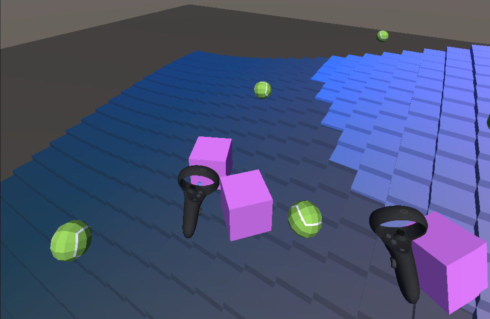
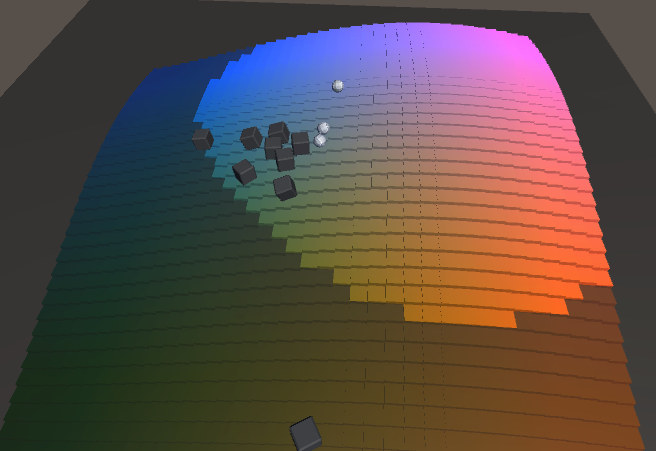
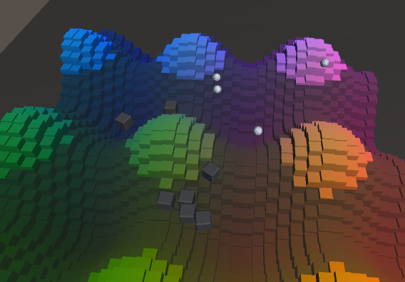

# bumpy
Physics / Audio toy for Oculus Quest made in Unity.

## Notes
This is as far as I'll take this and still call it a sketch.
Might do some more work on this elsewhere and look into:
* Adding an environment / level design
* Music loops
* Something happening / interactivity higher up from the floor
* Player movement

## Credits
* Animated floor based on [Catlike Coding](https://catlikecoding.com/unity/tutorials/basics/) tutorials
* [Tennis Ball](https://poly.google.com/view/4GfrdEiEmkb) by Google

